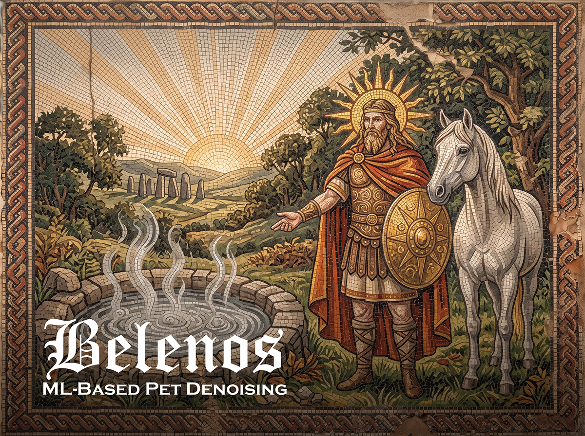
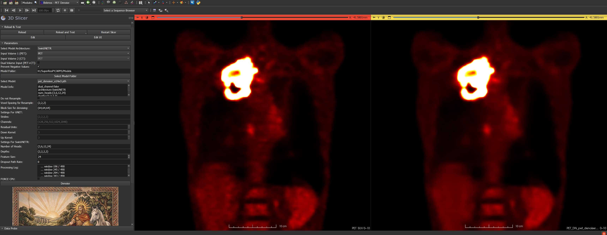
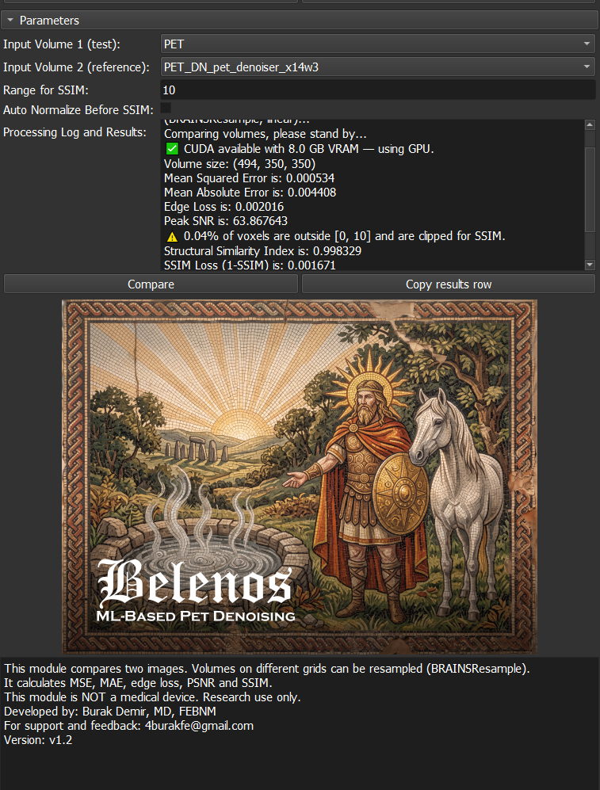
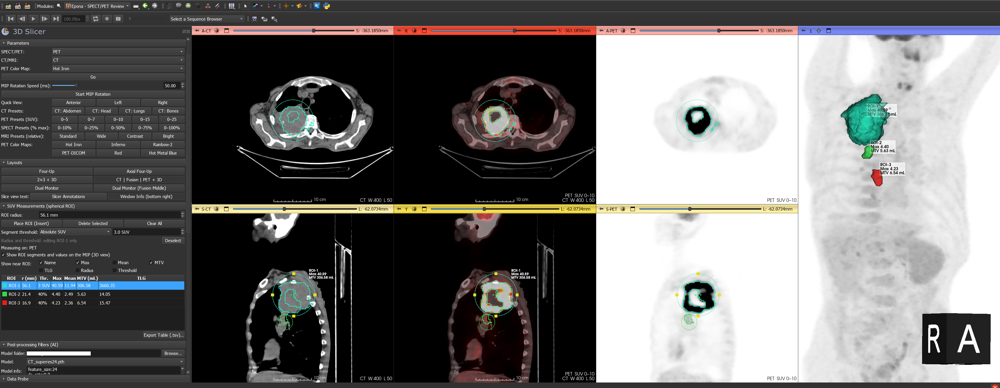

# SlicerPETDenoise Extension for 3D Slicer

**Author**: Burak Demir, MD, FEBNM  
**Module versions**: Belenos – PET Denoise v1.1 · Belenos – Volume Comparator v1.2 · Epona – SPECT/PET Review (EasyFusion) alpha v1.0  
**Contact**: 4burakfe@gmail.com

## Overview

SlicerPETDenoise is a 3D Slicer extension with three modules for medical image research, particularly SPECT/PET and CT/MRI workflows. They assist in denoising, comparing, and reviewing / fusing, segmenting volumetric data. The tools are developed with research utility in mind and are **not intended for clinical use**.

In Slicer the modules appear under the **Nuclear Medicine** category as:

| Folder | Module name in Slicer |
|---|---|
| `PETDenoise` | Belenos – PET Denoise |
| `VolumeComparator` | Belenos – Volume Comparator |
| `Easy_fusion` | Epona – SPECT/PET Review |

Related work: Demir, B., Atalay, M., Yurtcu, H. et al. Denoising of PET with SwinUNETR neural networks: impact of tumor oriented loss function, denoising module for 3D slicer. Ann Nucl Med (2026). https://doi.org/10.1007/s12149-026-02166-4

This extension is available in the 3D Slicer **Extensions Manager** (see [Installation](#installation)).

You can train your own models with the scripts provided here: https://github.com/4burakfe/Claritas 

Pretrained models ready for use: https://github.com/4burakfe/SlicerPETDenoise/releases/tag/Models

You can test the modules with the cases here: https://github.com/4burakfe/SlicerPETDenoise_SampleCases/releases/tag/images

---

## Modules

### 1. Belenos – PET Denoise

#### Purpose
Performs AI-based denoising of PET volumes using deep learning models. Supports UNET, SwinUNETR and SwinUNETR+GCFN architectures.

#### Features
- Accepts PET alone or PET+CT (dual channel)
- Loads `.pth` models; parameters from the associated `.txt` sidecar file are applied to the panel automatically
- Optional resampling to a chosen voxel spacing (or "Do not Resample")
- Sliding window inference with configurable block size
- "Prevent Negative Values" option
- CUDA acceleration when a GPU with enough memory is available, with a **FORCE CPU** option
- The model folder is remembered between sessions
- The input volume is never modified; output names are made unique so earlier results are not overwritten

#### How to Use
1. Select the input PET volume.
2. (Optional) Select the corresponding CT volume and tick **Dual Volume Input** for dual-channel models.
3. Click **Select Model Folder** and pick a folder containing `.pth` models with their `.txt` files.
4. Choose a model. Its settings are read from the `.txt` file; check or adjust architecture, voxel spacing and block size if needed.
5. Click **Denoise**. The output is a new volume named like `OriginalName_DN_ModelName`.

> Notes:
> - Missing Python packages (`monai`, `einops`) are offered for installation on first run.
> - If the GPU runs out of memory, try **FORCE CPU**, a smaller block size, or crop the volume first.

---

### 2. Belenos – Volume Comparator

#### Purpose
Computes numerical differences between two volumes using several image similarity metrics.

#### Metrics Calculated
- Mean Squared Error (MSE)
- Mean Absolute Error (L1)
- Structural Similarity Index (SSIM) and SSIM loss (1 − SSIM)
- PSNR
- Edge Loss (via gradient differences)

Metric formulas are unchanged from v1.0, so results remain comparable with earlier runs.

#### Features
- **Different voxel grids are handled**: if the volumes differ in geometry, the module offers to resample one onto the other (BRAINSResample, linear) or to compare index by index. It stops with an explanation if the volumes are under different transforms or do not cover the same region, and warns about differing DICOM Frames of Reference. The original volumes are never changed.
- **Auto Normalize Before SSIM**: joint min–max normalization of both volumes to [0, 1]. Without it, both volumes are clipped to [0, range] and the share of clipped voxels is reported.
- **Copy results row**: copies all metrics as one semicolon-separated row, ready to paste into a spreadsheet.
- Runs on the GPU and automatically repeats on the CPU if the GPU runs out of memory.

#### How to Use
1. Load the two volumes to compare.
2. Enter the SSIM range (default: 10), or tick **Auto Normalize Before SSIM**.
3. Click **Compare** and choose how to handle different grids if asked.
4. The log shows the computed metrics; use **Copy results row** to export them.

> Note: PyTorch and MONAI are required.

---

### 3. Epona – SPECT/PET Review (EasyFusion)

#### Purpose
A reading environment for SPECT/PET with CT/MRI: fusion, MIP, reading layouts, windowing presets, SUV measurements with spherical ROIs, and optional AI post-processing filters.

#### Fusion and MIP
- Select the SPECT/PET and CT/MRI volumes, choose a color map and click **Go** to set up fusion and the 3D MIP. After the first **Go**, changing either volume updates the views immediately.
- MIP rotation with adjustable speed, and quick views (Anterior, Left, Right). Rotation no longer starts on its own after loading a scene.
- PET color maps: Hot Iron, Inferno, Rainbow-2, PET-DICOM, Red, Hot Metal Blue.

#### Windowing presets and keyboard shortcuts
- **CT**: Abdomen, Head, Lungs, Bones
- **PET (SUV)**: 0–5, 0–7, 0–10, 0–15, 0–25
- **SPECT (% of max)**: 0–10 / 25 / 50 / 75 / 100 % of the maximum count
- **MRI (relative)**: Standard, Wide, Contrast, Bright — percentile windows computed on tissue voxels (air / background excluded), for MRI or any image without absolute units
- With the mouse over a view, **F5–F9** apply the presets for that view: CT presets on CT views (or MRI presets when the volume is an MRI), SUV presets on fusion, PET-only and 3D views. Shortcuts also work in the second-monitor window.

#### Layouts
- **Four-Up**: axial, sagittal and coronal fusion + 3D MIP
- **Axial Four-Up**: axial fusion | 3D MIP over axial CT | axial PET
- **2×3 + 3D**: fusion and CT (axial, sagittal) with the MIP on the right
- **CT | Fusion | PET + 3D**: axial and sagittal CT, fusion and PET side by side with the MIP
- **Dual Monitor** and **Dual Monitor (Fusion Middle)**: 3×2 slice views on monitor 1, 3D MIP + coronal fusion + coronal CT in a separate window for monitor 2 (requires Slicer 5.2 or later; click again to bring the second window back if it was closed)

PET-only views are shown in inverted grey. Window / level changes stay synchronized between fusion and PET-only views.

#### Slice view text
- **Slicer Annotations**: shows or hides Slicer's own corner annotations; the previously active corners are restored when turned back on.
- **Window Info (bottom right)**: shows the current CT/MRI window / level and SPECT/PET range (in SUV for PET) in each slice view, following presets, shortcuts and mouse drags.

#### SUV measurements (spherical ROIs)
- Place an ROI with **Place ROI** or by pressing **Insert** over a slice view. Drag the center to move it and the yellow edge handles to resize it.
- Each ROI reports sphere **Max** and a thresholded segment giving segment **Mean**, **MTV** (mL) and **TLG**. The threshold is either % of the ROI's Max (default 40 %) or an absolute SUV (default 2.5), and each ROI keeps its own radius and threshold.
- Select a row in the table to jump to that ROI and edit it; **Deselect** returns the controls to the defaults for new ROIs.
- Choose which values are shown next to each ROI (Name, Max, Mean, MTV, TLG, Radius, Threshold).
- Segments and values can be shown on top of the MIP (display only, nothing is added to the scene).
- **Export Table (.tsv)** saves all ROIs at full precision with ROI centers, statistics, threshold and the source PET volume.
- ROIs, segments and their settings are saved with the scene and restored when it is reloaded.

> Values are read directly from the selected PET volume, which is assumed to already be in SUV units.

#### Post-processing filters (AI)
- Runs Belenos PET Denoise models (`.pth` + `.txt`) directly from the review module on either the SPECT/PET or the CT/MRI volume (the target is guessed from the model's `.txt` file or name and can be changed). Dual-channel models are supported.
- **Limit to ROI** crops to an adjustable box before filtering, which is much faster and needs far less memory; volumes under non-linear transforms are handled too.
- A confirmation dialog shows the model and estimated job size before running, and the run can be cancelled.
- The result is always a **new volume**; the original is never changed. Views, MIP and SUV ROIs switch to the filtered volume.
- **Force CPU** option; missing packages (`monai`, `einops`) are offered for installation, and PyTorch can be installed via PyTorch Utils when needed.

> Note: SUVs measured on a filtered volume differ from those of the original.

#### How to Use
1. Load the SPECT/PET and CT/MRI volumes and select them in the panel.
2. Choose a color map and click **Go**.
3. Pick a layout, then use the presets or F5–F9 for windowing.
4. Place ROIs with **Insert** for SUV measurements and export the table if needed.
5. (Optional) Open **Post-processing Filters (AI)** to denoise or enhance a volume.

> Note: Apart from AI filters (which create new volumes), this module only affects visualization, not image content.

---

## Installation

### From the Extensions Manager (recommended)

1. Install [3D Slicer](https://www.slicer.org/) (5.2 or later is needed for the dual monitor layouts).
2. Open **View → Extensions Manager** (or the Extensions Manager icon in the toolbar).
3. Search for **PETDenoise** and click **Install**. The **PyTorch** extension (PyTorchUtils) is installed with it as a dependency.
4. Restart Slicer when prompted. The modules appear under the **Nuclear Medicine** category.
5. Open the **PyTorch Utils** module once to install PyTorch, choosing the CUDA build that matches your GPU (or CPU only).

### Manual installation (latest development version)

1. Clone or download this repository and extract the zip folder.
2. In 3D Slicer go to **Edit → Application Settings → Modules → Additional Module Paths**.
3. Click the **>>** button and add the `PETDenoise`, `VolumeComparator` and `Easy_fusion` folders.
4. Restart Slicer.

---

## Dependencies

These modules use several Python libraries inside Slicer's environment:
- `torch`
- `monai`
- `einops`

PyTorch must be installed with the **PyTorchUtils** module (installed together with this extension from the Extensions Manager), where you can choose the CUDA build matching your GPU (or CPU only). `monai` and `einops` are offered for installation automatically when first needed.

- **PET Denoise** and **Volume Comparator** depend on PyTorchUtils: if it is not installed, these two modules will not appear.
- **Epona – SPECT/PET Review** works without PyTorch; it is only needed for its AI post-processing filters.

A CUDA-capable GPU with a CUDA-enabled PyTorch build is highly recommended; otherwise denoising will be very slow.
