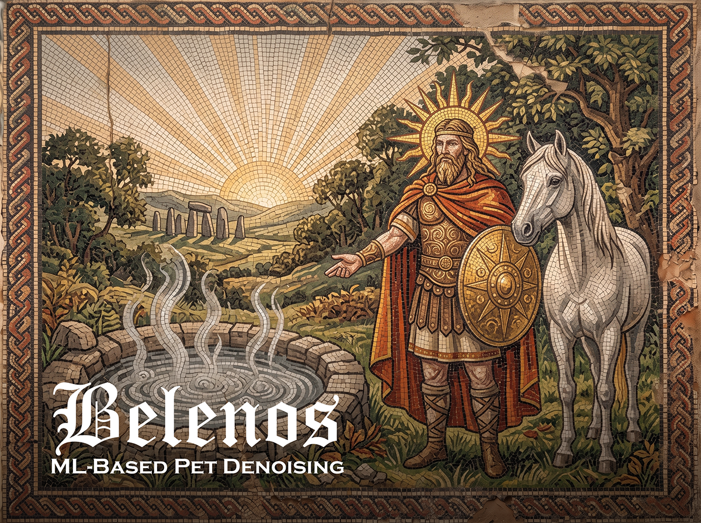
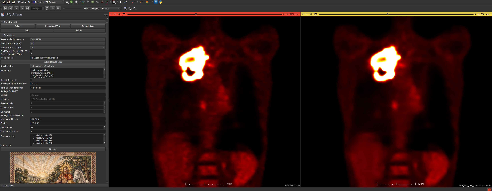
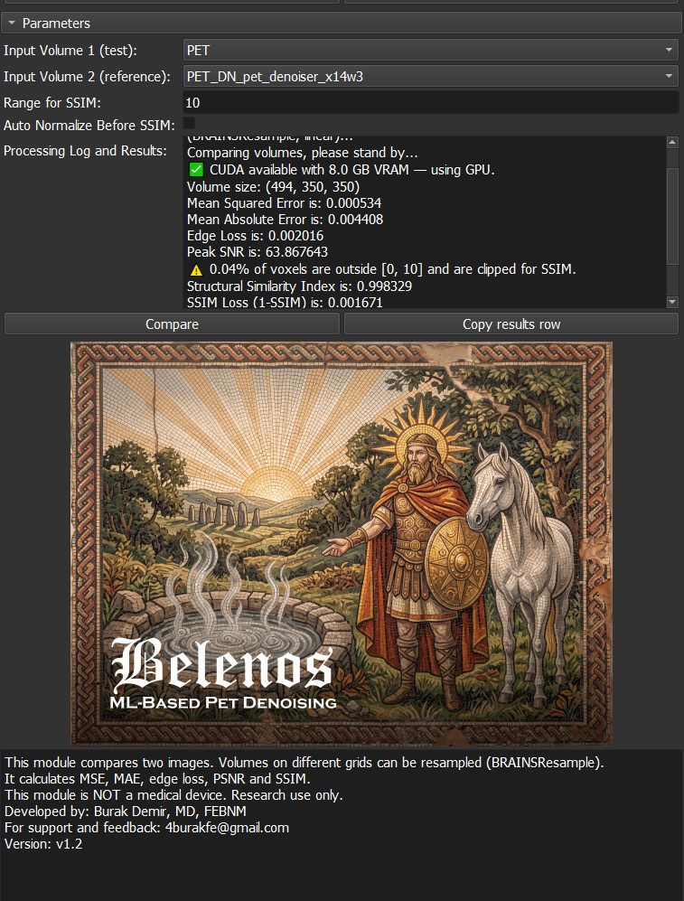

# SlicerPETDenoise Extension for 3D Slicer

**Author**: Burak Demir, MD, FEBNM  
**Module versions**: Belenos – PET Denoise v1.1 · Belenos – Volume Comparator v1.2  
**Contact**: 4burakfe@gmail.com

## Overview

SlicerPETDenoise is a 3D Slicer extension with two modules for medical image research, particularly PET and CT workflows. They assist in denoising and comparing volumetric data. The tools are developed with research utility in mind and are **not intended for clinical use**.

In Slicer the modules appear under the **Nuclear Medicine** category as:

| Folder | Module name in Slicer |
|---|---|
| `PETDenoise` | Belenos – PET Denoise |
| `VolumeComparator` | Belenos – Volume Comparator |

> **Epona – SPECT/PET Review (EasyFusion)** has moved to its own extension, [SlicerPETReviewCompare](https://github.com/4burakfe/SlicerPETReviewCompare) (**PETReviewCompare** in the Extensions Manager). It can still run the denoising models of this extension as AI post-processing filters, and picks up the model folder selected here.

Related work: Demir, B., Atalay, M., Yurtcu, H. et al. Denoising of PET with SwinUNETR neural networks: impact of tumor oriented loss function, denoising module for 3D slicer. Ann Nucl Med (2026). https://doi.org/10.1007/s12149-026-02166-4

This extension is available in the 3D Slicer **Extensions Manager** (see [Installation](#installation)).

You can train your own models with the scripts provided here: https://github.com/4burakfe/Claritas 

Pretrained models ready for use: https://github.com/4burakfe/SlicerPETDenoise/releases/tag/Models

You can test the modules with the cases here: https://github.com/4burakfe/SlicerPETDenoise_SampleCases/releases/tag/images

---

## Modules

### 1. Belenos – PET Denoise

#### Purpose
Performs AI-based denoising of PET volumes using deep learning models. Supports UNET, SwinUNETR and SwinUNETR+GCFN architectures.

#### Features
- Accepts PET alone or PET+CT (dual channel)
- Loads `.pth` models; parameters from the associated `.txt` sidecar file are applied to the panel automatically
- Optional resampling to a chosen voxel spacing (or "Do not Resample")
- Sliding window inference with configurable block size
- "Prevent Negative Values" option
- CUDA acceleration when a GPU with enough memory is available, with a **FORCE CPU** option
- The model folder is remembered between sessions
- The input volume is never modified; output names are made unique so earlier results are not overwritten

#### How to Use
1. Select the input PET volume.
2. (Optional) Select the corresponding CT volume and tick **Dual Volume Input** for dual-channel models.
3. Click **Select Model Folder** and pick a folder containing `.pth` models with their `.txt` files.
4. Choose a model. Its settings are read from the `.txt` file; check or adjust architecture, voxel spacing and block size if needed.
5. Click **Denoise**. The output is a new volume named like `OriginalName_DN_ModelName`.

> Notes:
> - Missing Python packages (`monai`, `einops`) are offered for installation on first run.
> - If the GPU runs out of memory, try **FORCE CPU**, a smaller block size, or crop the volume first.

---

### 2. Belenos – Volume Comparator

#### Purpose
Computes numerical differences between two volumes using several image similarity metrics.

#### Metrics Calculated
- Mean Squared Error (MSE)
- Mean Absolute Error (L1)
- Structural Similarity Index (SSIM) and SSIM loss (1 − SSIM)
- PSNR
- Edge Loss (via gradient differences)

Metric formulas are unchanged from v1.0, so results remain comparable with earlier runs.

#### Features
- **Different voxel grids are handled**: if the volumes differ in geometry, the module offers to resample one onto the other (BRAINSResample, linear) or to compare index by index. It stops with an explanation if the volumes are under different transforms or do not cover the same region, and warns about differing DICOM Frames of Reference. The original volumes are never changed.
- **Auto Normalize Before SSIM**: joint min–max normalization of both volumes to [0, 1]. Without it, both volumes are clipped to [0, range] and the share of clipped voxels is reported.
- **Copy results row**: copies all metrics as one semicolon-separated row, ready to paste into a spreadsheet.
- Runs on the GPU and automatically repeats on the CPU if the GPU runs out of memory.

#### How to Use
1. Load the two volumes to compare.
2. Enter the SSIM range (default: 10), or tick **Auto Normalize Before SSIM**.
3. Click **Compare** and choose how to handle different grids if asked.
4. The log shows the computed metrics; use **Copy results row** to export them.

> Note: PyTorch and MONAI are required.

---

## Installation

### From the Extensions Manager (recommended)

1. Install [3D Slicer](https://www.slicer.org/).
2. Open **View → Extensions Manager** (or the Extensions Manager icon in the toolbar).
3. Search for **PETDenoise** and click **Install**. The **PyTorch** extension (PyTorchUtils) is installed with it as a dependency.
4. Restart Slicer when prompted. The modules appear under the **Nuclear Medicine** category.

For SPECT/PET reading (fusion, MIP, SUV ROIs), also install **PETReviewCompare**.
5. Open the **PyTorch Utils** module once to install PyTorch, choosing the CUDA build that matches your GPU (or CPU only).

### Manual installation (latest development version)

1. Clone or download this repository and extract the zip folder.
2. In 3D Slicer go to **Edit → Application Settings → Modules → Additional Module Paths**.
3. Click the **>>** button and add the `PETDenoise` and `VolumeComparator` folders.
4. Restart Slicer.

---

## Dependencies

These modules use several Python libraries inside Slicer's environment:
- `torch`
- `monai`
- `einops`

PyTorch must be installed with the **PyTorchUtils** module (installed together with this extension from the Extensions Manager), where you can choose the CUDA build matching your GPU (or CPU only). `monai` and `einops` are offered for installation automatically when first needed.

- **PET Denoise** and **Volume Comparator** depend on PyTorchUtils: if it is not installed, these two modules will not appear.

A CUDA-capable GPU with a CUDA-enabled PyTorch build is highly recommended; otherwise denoising will be very slow.
