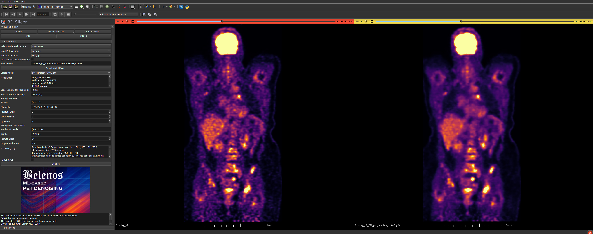

# SlicerPETDenoise Extension for 3D Slicer

**Author**: Burak Demir, MD, FEBNM  
**Version**: 1.0  
**Contact**: 4burakfe@gmail.com

## Overview

SlicerPETDenoise is a 3D Slicer extension that includes three modules intended for medical image research, particularly PET and CT image workflows. These modules assist in denoising, comparing, and visually fusing volumetric medical data. The tools are developed with research utility in mind and are not intended for clinical use.
Related work: Demir, B., Atalay, M., Yurtcu, H. et al. Denoising of PET with SwinUNETR neural networks: impact of tumor oriented loss function, denoising module for 3D slicer. Ann Nucl Med (2026). https://doi.org/10.1007/s12149-026-02166-4

This extension is not currently on Extension Manager of the 3D Slicer but can be installed manually.
For installation download this repository and extract the zip folder. 
Then in the 3D Slicer go to Edit->Application Settings->Modules->Additional Module Paths
Here click >> button and manually add PETDenoise, VolumeComparator and Easy_fusion folders.

SlicerPETDenoise, SlicerVolumeComparator requires Pytorch to be installed to operate. 
You can install it from extension manager with PyTorchUtils extension.
If Pytorch Utils is not installed the modules will not be shown.

It is highly recommended to have CUDA capable GPU and if so be sure you have installed CUDA enabled version of Pytorch. Otherwise, it will work very very slow.

You can train your own models with scripts provided here: https://github.com/4burakfe/Claritas 

This repository also contains pretrained models ready for use: https://github.com/4burakfe/SlicerPETDenoise/releases/tag/Models

You can test this module with the cases in here: https://github.com/4burakfe/SlicerPETDenoise_SampleCases/releases/tag/images

---

## Modules

### 1. PET Denoise

#### Purpose
Performs AI-based denoising of PET volumes using deep learning models. Supports UNET, SwinUNETR, and SwinUNETR+GCFN architectures.

#### Features
- Accepts PET alone or PET+CT (dual channel)
- Loads `.pth` models with associated `.txt` configuration
- Applies sliding window inference on volumes
- CUDA acceleration (if available)

#### How to Use
1. Select input PET volume.
2. (Optional) Select corresponding CT volume for dual-channel denoising.
3. Choose model architecture and parameters (UNET/SwinUNETR).
4. Select a folder containing `.pth` model and config `.txt` file.
5. Adjust voxel spacing and block size if needed.
6. Click **Denoise**. The output will be a new volume named like `OriginalName_DN_ModelName`.

> Notes:
> - You may be prompted to install required Python packages (`monai`, `einops`).
> - Ensure the model folder and config file are correctly formatted.

---

### 2. Volume Comparator

#### Purpose
Computes numerical differences between two volumes using several image similarity metrics.

#### Metrics Calculated
- Mean Squared Error (MSE)
- Mean Absolute Error (L1)
- Structural Similarity Index (SSIM)
- PSNR
- Edge Loss (via gradient differences)

#### How to Use
1. Load two volumetric datasets (same shape and resolution).
2. Enter SSIM dynamic range value (default: 10).
3. Click **Compare**.
4. Log area will display computed metrics.

> Note: PyTorch and MONAI are required.

---

### 3. EasyFusion

#### Purpose
Provides basic image fusion for PET/SPECT and CT/MRI volumes. Includes tools for PET color mapping, CT windowing, and 3D view control.

#### How to Use
1. Load both SPECT/PET and CT/MR volumes.
2. Use buttons to select:
   - PET color map (Inferno, Hot Iron, etc.)
   - CT windowing (head, abdomen, etc.)
   - View rotation and orientation
3. Click **Go** to initiate 3D volume rendering and MIP setup.
4. Use toggle to start/stop rotation or change angle.

> Note: This module only affects visualization, not image content.

---

## Installation

1. Install [3D Slicer](https://www.slicer.org/)
2. Clone or download this repository.
3. Copy the folder into your Slicer's `Extensions` directory or develop via the **Developer Tools > Extension Wizard**.
4. Restart Slicer.
5. Modules will appear under the **Nuclear Medicine** category.

---

## Dependencies

This extension uses several Python libraries inside Slicer's environment:
- `torch`
- `monai`
- `einops`

Torch must be installed with PyTorchUtils extension...
If PyTorchUtils is not installed the modules will not appear.
